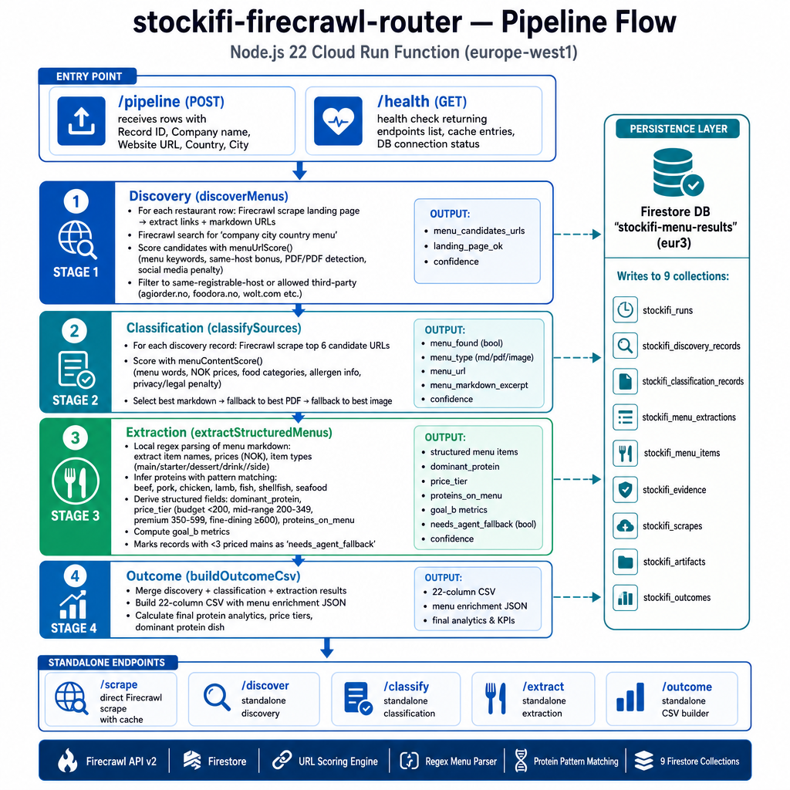
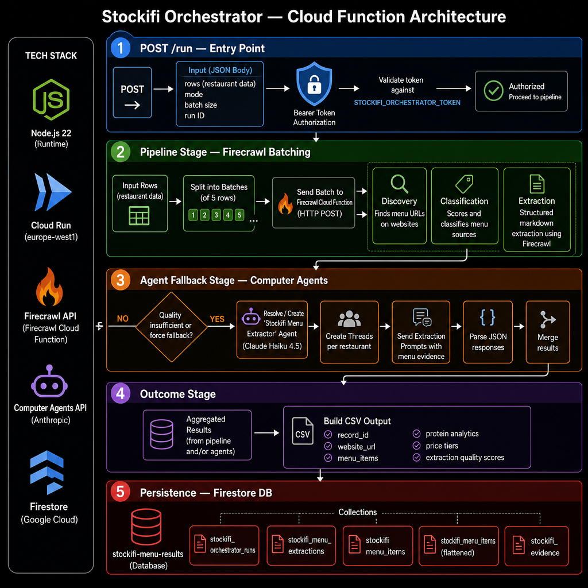

# Stockifi Computer Agents Setup

This repository is a focused customer setup package for the Stockifi hospitality enrichment workflow on Computer Agents.

It contains:

- scripts to create the Computer Agents cloud functions
- scripts to create and seed the results database
- the Firecrawl router function source
- the hosted orchestrator function source
- sample and validation datasets
- custom skill definitions for restaurant/menu workflows

It does not contain production secrets. Stockifi provides the API keys locally through `.env`.

## Architecture

The workflow uses a cheap deterministic path first, then falls back to agents only when the menu evidence needs judgement or visual/browser handling.



The hosted orchestrator function coordinates batch work and persists results into the Computer Agents database.



## What The Setup Creates

`npm run setup:cloud` creates or updates:

- `stockifi-firecrawl-router`
  A Computer Agents function that wraps Firecrawl discovery, scraping, menu-source classification, structured extraction, and outcome CSV generation.
- `stockifi-orchestrator`
  A Computer Agents function that runs batches through the router, optionally triggers Computer Agents extraction fallback, and persists run artifacts.
- `stockifi-menu-results`
  A Computer Agents database with collections for runs, discovery records, classification records, extraction records, menu items, evidence, scrapes, artifacts, outcomes, and orchestrator runs.
- `stockifi-firecrawl-secrets`
  A Computer Agents secrets vault for `FIRECRAWL_API_KEY`, `COMPUTER_AGENTS_API_KEY`, and the orchestrator bearer token.

The scripts are idempotent by name. Re-running them updates the existing resources instead of creating duplicates.

## Requirements

- Node.js 20+
- A Computer Agents API key
- A Firecrawl API key
- Access to the Computer Agents workspace where the resources should be created

## Quick Start

Install dependencies:

```bash
npm ci
```

Create local configuration:

```bash
cp .env.example .env
```

Edit `.env` and set at least:

```bash
COMPUTER_AGENTS_API_KEY=...
STOCKIFI_FIRECRAWL_API_KEY=...
```

Optional but recommended:

```bash
STOCKIFI_PROJECT_ID=...
STOCKIFI_RESULTS_DATABASE_LOCATION=eur3
STOCKIFI_FIRECRAWL_FUNCTION_REGION=europe-west1
STOCKIFI_ORCHESTRATOR_FUNCTION_REGION=europe-west1
```

Check that the Computer Agents key works:

```bash
npm run doctor
```

Create the hosted functions, secrets vault, and database:

```bash
npm run setup:cloud
```

At the end, the setup command prints values like:

```bash
STOCKIFI_FIRECRAWL_SERVER_ID=...
STOCKIFI_FIRECRAWL_SECRETS_SERVER_ID=...
STOCKIFI_RESULTS_DATABASE_ID=...
STOCKIFI_FIRECRAWL_FUNCTION_URL=https://...
STOCKIFI_ORCHESTRATOR_SERVER_ID=...
STOCKIFI_ORCHESTRATOR_FUNCTION_URL=https://...
STOCKIFI_ORCHESTRATOR_TOKEN=...
```

Copy those values into `.env`. They make later reruns target the same resources.

## Seed The Database

After `setup:cloud`, the database exists. To seed the workflow database used by the agent pipeline:

```bash
npm run bootstrap
npm run seed:restaurants
```

The default seed file is:

```bash
data/restaurants.sample.csv
```

To use the validation subset instead:

```bash
STOCKIFI_RESTAURANTS_FILE=./data/NO_companies_N50.csv npm run seed:restaurants
```

## Run A Batch

Run the Computer Agents batch workflow:

```bash
npm run run:batch
```

Run one selected restaurant:

```bash
STOCKIFI_RESTAURANT_SLUG=jw-steakhouse-berlin npm run run:restaurant
```

Create or refresh the recurring twice-monthly schedule:

```bash
npm run schedule:refresh
```

## Run The Hosted Functions Directly

Health check the Firecrawl router:

```bash
curl "$STOCKIFI_FIRECRAWL_FUNCTION_URL/health"
```

Run a small router pipeline request:

```bash
curl -X POST "$STOCKIFI_FIRECRAWL_FUNCTION_URL/pipeline" \
  -H "Content-Type: application/json" \
  -d '{
    "runId": "manual-smoke",
    "rows": [
      {
        "record_id": "smoke-1",
        "company_name": "Wok & Roll",
        "website_url": "https://woknroll.no",
        "country_region": "NO",
        "city": "Oslo"
      }
    ],
    "extractStructured": true,
    "buildOutcome": true
  }'
```

Run the orchestrator:

```bash
curl -X POST "$STOCKIFI_ORCHESTRATOR_FUNCTION_URL/run" \
  -H "Content-Type: application/json" \
  -H "Authorization: Bearer $STOCKIFI_ORCHESTRATOR_TOKEN" \
  -d '{
    "mode": "all",
    "rows": [
      {
        "record_id": "smoke-1",
        "company_name": "Wok & Roll",
        "website_url": "https://woknroll.no",
        "country_region": "NO",
        "city": "Oslo"
      }
    ]
  }'
```

## Datasets

Included datasets:

- `data/restaurants.sample.csv`
  Small editable seed catalog for setup smoke tests.
- `data/NO_companies_N50.csv`
  Validation subset for controlled Norwegian hospitality runs.
- `data/benchmark_outcome.csv`
  Benchmark output shape for goal-B validation.
- `data/enrichment-rules.md`
  Business rules for enrichment and normalization.
- `data/gold_set/*.json`
  Hand-checked menu extraction examples.
- `data/summaries/*.json`
  Compact pipeline summary artifacts useful for sanity checks.

Use the N50 file for early validation before moving to larger customer-owned exports.

## Available Commands

```bash
npm run doctor
npm run blueprint
npm run setup:cloud
npm run create:firecrawl-function
npm run create:orchestrator-function
npm run bootstrap
npm run install:skills
npm run seed:restaurants
npm run run:batch
npm run run:restaurant
npm run schedule:refresh
npm run estimate:pricing
npm run validate
```

## Configuration Notes

The setup scripts read `.env` and never commit secrets.

Important variables:

- `COMPUTER_AGENTS_API_KEY`
  Customer API key for Computer Agents.
- `STOCKIFI_FIRECRAWL_API_KEY`
  Customer Firecrawl key. Stored in the Computer Agents secrets vault by default.
- `STOCKIFI_USE_SECRETS_VAULT`
  Defaults to `1`. Keep enabled for normal deployments.
- `STOCKIFI_USE_RESULTS_DATABASE`
  Defaults to `1`. Keep enabled so function outputs are durable and inspectable.
- `STOCKIFI_EMBED_FIRECRAWL_SECRET`
  Defaults to `0`. Do not enable unless a legacy deployment cannot use the secrets vault.
- `STOCKIFI_RESULTS_DATABASE_ID`
  Set after the first setup if you want reruns to bind the same database explicitly.

## Repository Scope

This repo is intentionally scoped to the customer handoff:

- setup automation
- function source
- database seeding
- sample datasets
- docs

It intentionally excludes:

- production secrets
- local state files
- generated run folders
- full private evaluation archives

Local files ignored by git:

- `.env`
- `.stockifi-cloud-state.json`
- `.stockifi-workflow-state.json`
- `runs/`

## Troubleshooting

If setup fails before printing IDs:

1. Run `npm run doctor`.
2. Confirm the Computer Agents API key belongs to the correct workspace.
3. Confirm `STOCKIFI_FIRECRAWL_API_KEY` is set.
4. Re-run `npm run setup:cloud`.

If reruns create unexpected resources, copy the printed `STOCKIFI_*_ID` values into `.env` and rerun.
